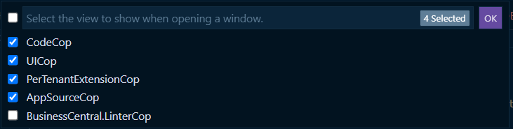

# BusinessCentral.LinterCop

[](https://opensource.org/licenses/MIT)

This extension provides auto updates for the BusinessCentral.LinterCop and other custom analyzers. These analyzers are basically just DLL files and need to be placed into the folder of the AL VS Code extension. If you want to do this manually, you don't need this extension ;)

By default, the extension checks if the DLL is still there (and did not get deleted due to updates of the AL Extension) and if a new version is released. If one case is true, the latest version of the DLL will be downloaded.

In order to activate the LinterCop and other analyzers, all you need to do is click the `AL Cops` indicator on the bottom bar, which shows the active code analyzers for the current settings context:  


This will open a menu where you can select the BusinessCentral.LinterCop and other custom analyzers. When you confirm with `OK`, the new config will be saved in your active settings file.


Note: The bottom bar will always show you which AL analyzers are currently active for the file you are editing.

## Extension Settings

* `linterCop.autoDownload`: Enable/disable automatic download and updates of the linter DLLs. If you disable it, you can still always trigger the download manually with the command `LC: Download Linter Cop`.
* `linterCop.load-pre-releases`: Enable/disable automatic download and updates of pre-releases. Enable this if you always want to have the latest updates, even if they may have some bugs.
* `linterCop.repositories`: Define custom GitHub repositories for analyzers. Each repository can include a URL, an optional authentication token, a file name for the analyzer DLL, and a short name for display in the status bar.

### Example Configuration

```json
{
    "linterCop.repositories": [
        {
            "url": "https://github.com/YourOrg/YourAnalyzer",
            "token": "your-github-token",
            "fileName": "YourAnalyzer.dll",
            "shortName": "YourAnalyzer"
        },
        {
            "url": "https://github.com/AnotherOrg/AnotherAnalyzer",
            "fileName": "AnotherAnalyzer.dll",
            "shortName": "AnotherAnalyzer"
        }
    ]
}

The actual linter code is located here: https://github.com/StefanMaron/BusinessCentral.LinterCop