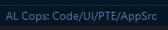
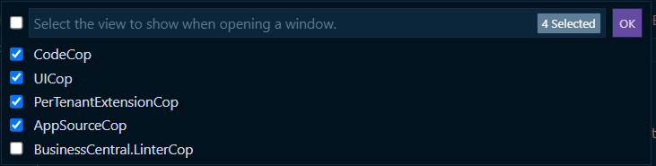

# BusinessCentral.LinterCop

[](https://opensource.org/licenses/MIT)

> [!WARNING]
> **⚠️ Deprecated — action required before October 2026**
>
> [BusinessCentral.LinterCop](https://github.com/StefanMaron/BusinessCentral.LinterCop) has reached end-of-life. The last supported AL Language version is the release from 25 March 2026, and once AL Language v18 becomes the current release (expected around October 2026), BusinessCentral.LinterCop will stop working.
>
> Development has moved to [ALCops](https://alcops.dev/), the successor to BusinessCentral.LinterCop. We strongly recommend migrating sooner rather than later:
>
> * 📢 Announcement: [Action Required: Migrate to ALCops before October 2026](https://github.com/StefanMaron/BusinessCentral.LinterCop/issues/1227)
> * 🚀 Get started: [alcops.dev](https://alcops.dev/)
> * 📖 Migration guide: [LinterCop Migration Guide](https://alcops.dev/docs/lintercop-migration/)
>
> This extension itself keeps working for downloading analyzers from your own (private) repositories via the `linterCop.repositories` setting.

This extensions provides auto updates for the BusinessCentral.LinterCop. This cop is basically just an dll file and needs to be placed into the folder of the AL vs code extension. If you want to do this manually, you dont need this extension ;)

By default the extension checks if the dll is still there (and did not get deleted due to updates of the AL Extension) and if a new version is released.
If one case is true, the latest version of the dll will be downloaded.

In order to activate the LinterCop all you need to do is, to click the `AL Cop` indicator on the bottom bar which shows the active code analyzers for the current settings context:  


This will open a menu where you can select the BusinessCentral.LinterCop. When you confirm with `OK` the new config will be saved in your active settings file.


Note: The bottom bar will always show you which AL analyzers are currently active for the file you are editing.

## Extension Settings

* `linterCop.autoDownload`: enable/disable automatic download and updates of the linter dll. If you disable it, you can still always trigger the download manually with the command `LC: Download Linter Cop`. 
* `linterCop.load-pre-releases`: enable/disable automatic download and updates of of pre-releases. Enable this if you always want to have the latest updates, even if they may have some bugs. 

```json
{
    "linterCop.repositories": [
        {
            "url": "https://github.com/YourOrg/YourAnalyzer",
            "token": "your-github-token",
            "fileName": "YourAnalyzer.dll",
            "shortName": "YourAnalyzer"
        },
        {
            "url": "https://github.com/AnotherOrg/AnotherAnalyzer",
            "fileName": "AnotherAnalyzer.dll",
            "shortName": "AnotherAnalyzer"
        }
    ]
}
```

The actual linter code is located here: https://github.com/StefanMaron/BusinessCentral.LinterCop